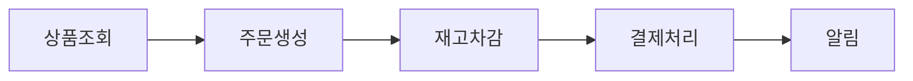
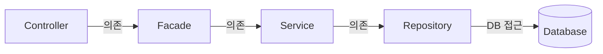

# Commerce-Arch

> [basic-arch](https://github.com/Kimjiman/basic-arch)를 기본으로 하는 이커머스 구현.


---

## 1. 목표

> 이커머스의 한 싸이클을 구현하고, 거기서 발생하는 동시성 제어와 그로 인해 발생하는 트레이드 오프, 장애 대응에 대해 학습한다.




### 주요 기술
1. Kafka
2. Redis

---

## 2. 아키텍쳐



### 기술 스택

| 분류       | 기술                                           |
|----------|----------------------------------------------|
| 언어 / 플랫폼 | Java 21, Spring Boot 3.5, Gradle             |
| 데이터 접근   | Spring Data JPA, QueryDSL, Flyway            |
| 매핑       | MapStruct, Lombok                            |
| 인증 / 보안  | Spring Security, JWT                         |
| 캐시       | Spring Cache(Caffeine), Redis Pub/Sub, Kafka |
| 토큰 저장소   | Redis (Refresh Token)                        |
| 데이터베이스   | PostgreSQL 15                                |
| API 문서   | SpringDoc OpenAPI (Swagger UI)               |
| 로컬 인프라   | [Docker Compose](docker-compose.yml)         |
| 모니터링     | Prometheus, Grafana, Actuator                |
| 클라우드     | AWS EC2, RDS(PostgreSQL), ElastiCache(Redis) |
| CI/CD    | GitHub Actions                               |

### 프로젝트 구조

```
src/main/java/com/basicarch/
├── base/        공통 인프라 (annotation, cache, component, constants, exception, model, redis, security, utils)
│   └── cache/   캐시 아키텍처 (CacheEventPublisher, redis/, kafka/, spring/)
├── config/      Spring 설정 (Security, Cache, Redis, Kafka, Swagger, advice, listener)
└── module/
    ├── user/    사용자, 인증
    ├── code/    공통 코드/코드그룹
    └── file/    파일 업로드/다운로드
```

### 공통 유틸리티

| 클래스                                                                            | 주요 기능                                                 |
|--------------------------------------------------------------------------------|-------------------------------------------------------|
| [StringUtils](src/main/java/com/basicarch/base/utils/StringUtils.java)         | isBlank/isEmpty, masking, lpad/rpad, regex, 포맷        |
| [DateUtils](src/main/java/com/basicarch/base/utils/DateUtils.java)             | LocalDateTime-Date-String 변환, 요일, 날짜 연산               |
| [CollectionUtils](src/main/java/com/basicarch/base/utils/CollectionUtils.java) | safeStream, merge, separationList, toMap, extractList |
| [CryptoUtils](src/main/java/com/basicarch/base/utils/CryptoUtils.java)         | 랜덤 문자열 생성, SecretKey 생성                               |
| [SessionUtils](src/main/java/com/basicarch/base/utils/SessionUtils.java)       | SecurityContext에서 현재 사용자 정보 조회                        |
| [CommonUtils](src/main/java/com/basicarch/base/utils/CommonUtils.java)         | HTTP 응답 직접 쓰기, JWT 디코딩                                |

---